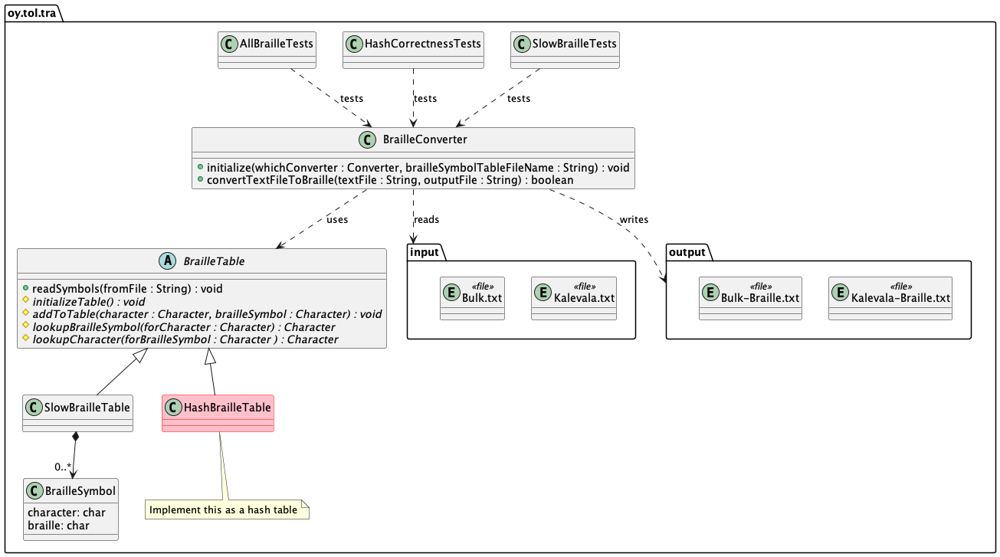
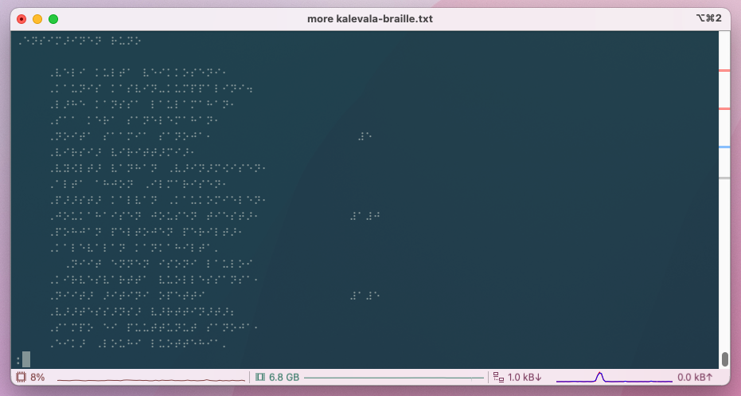
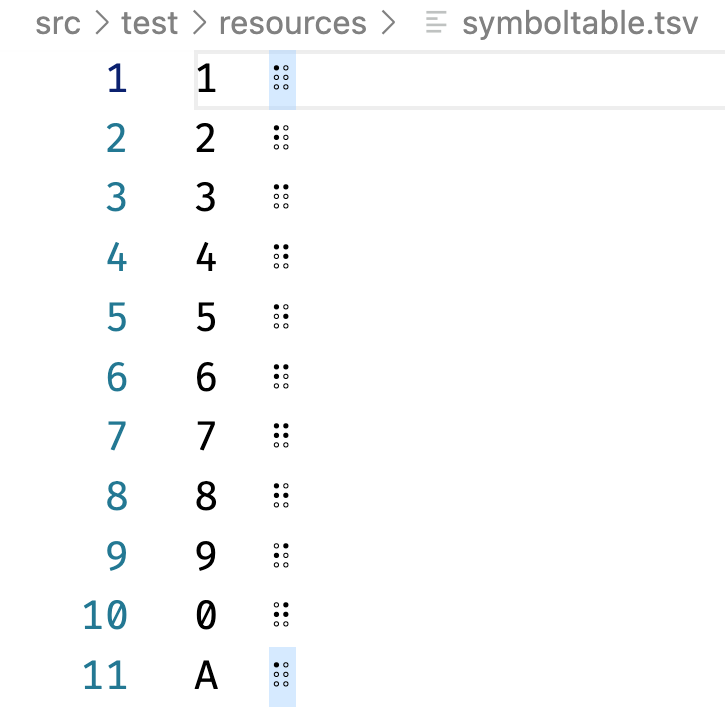

# Braille -kääntäjä - Vapaaehtoinen harjoitus

Tietorakenteet ja algoritmit 2022.

## Tavoite

Tämä *vapaaehtoinen* harjoitus liittyy aiheisiin:

1. [Braille](https://fi.wikipedia.org/wiki/Pistekirjoitus) -symbolit.
2. Hajautustaulujen toteutus.

Huomaa että braille -symbolit eli pistekirjoitus on *kieliriippuvaista*. Esimerkiksi suomen kielen braille -symbolit voivat olla erit kuin jonkun toisen kielen, vaikkapa englannin. Tässä harjoituksessa käytetään suomen kielen pistekirjoitussymboleita ([cf fi.wikipedia](https://fi.wikipedia.org/wiki/Pistekirjoitus#Unicode)).

Harjoituksen tavoitteena on:

* Tutkia kuinka toimii naiivi algoritmi joka muuntaa tavallista tekstiä (kuten kirjatiedostoja) pistekirjoitukseksi.
* Analysoida mainitun algoritmin aikakompleksisuutta.
* Suunnitella ja toteuttaa algoritmista hajautustauluja hyödyntävä nopeampi toteutus.
* Vertailla ensimmäisen annetun toteutuksen aikakompleksisuutta ja suoritusnopeutta suhteessa omaan hajautustaulutoteutukseesi.

**HUOMIO** Tässä **älä käytä** harjoituksen `67-phonebook` geneeristä hajautustaulua. Haasteena on pohtia miten tämä saadaan toteutettua paljon yksinkertaisemmin kun:

* ymmärrät miten Javan char (Character) -tietotyyppi ja int (Integer) -tietotyyppi liittyvät toisiinsa
* miten yllämainitun tiedon avulla voit toteuttaa helpost ns. lookup -tauluratkaisu siten että se samalla toteuttaa myös hajautustaulun periaatteen.

Tehtävästä **ei siis saa pisteitä** jos tässä käytetään `67-phonebook` -hajautustaulua! Varmista tarvittaessa opettajalta tehtävän tavoitteeseen liittyvät rajoitukset joita toteutuksessa on hyvä huomioida.

## Edeltävyydet

Työkalut toimivat, olet jo tehnyt aikaisempia harjoituksia.

Tiedät mitä hajautustaulut ovat ja miten niitä käytetään. Jos et tiedä, käy ensin läpi kurssin materiaali aiheesta.

## Ohjeet vaihe 1

Harjoitus sisältää valmiina annettua koodia:

* `BrailleSymbol` -- luokka joka sisältää tavallisen kirjaimen (`char`) ja sitä vastaavan braille -symbolin.
* `BrailleTable` -- *abstrakti kantaluokka*  joka toimii pohjana sille miten tavallisia kirjaimia mäpätään braille -symboleihin. Tätä luokkaa ei voi sellaisenaan käyttää, vaan on tehtävä tästä aliluokkia ja käyttää niitä.
* `SlowBrailleTable` -- luokan `BrailleTable` aliluokka joka toteuttaa **hitaan** ja naiivin tavan etsiä suomalaista kirjainta vastaava braille -symboli ja toisinpäin.
* `BrailleConverter` -- luokka joka lukee tekstitiedostoja ja käyttää `BrailleTable` aliluokkia konvertoimaan tekstiä pistekirjoitukseksi. Näitä voitaisiin sitten tulostaa pistekirjoitustulostimilla paperilla luettavaksi!

Lisäksi sovelluksessa on yksi keskeneräinen luokka jonka **sinä** toteutat -- `HashBrailleTable`. Tämän luokan tarkoitus on tehdä samaa kuin `SlowBrailleTable` tekee, mutta *paljon nopeammin* käyttäen hajautustauluja kirjainta vastaavan braille -symbolin etsimiseksi.

Braille -symbolit ovat Unicode -symbojeja alueella `U+2800–U+28FF`. Java voi siis käsitellä näitä koska Javan merkkitiedon yläraja on `U-FFFF`. Jos käyttämäsi terminaaliohjelma, kirjasin (fontti) ja tekstieditori tukevat Unicodea, näet nämä symbolit myös terminaalissa ja editorissa.

UML -luokkamalli alla esittää tämän harjoituksen ohjelman rakenteen:



**Ennen testaamista**, pura testitiedostot hakemistossa `src/test/resources/` olevasta zippitiedostosta siten että tekstitiedostot tulevat samaan hakemistoon kuin zippitiedosto.

Voit nyt testata hidasta valmiina annettua toteutusta testillä `SlowBrailleTests`:

```console
mvn -Dtest=SlowBrailleTests test
```

**Älä vielä suorita muita testejä** koska ne testaavat toteutusta jonka teet alla vaiheessa 2 alempana.

Testit käyttävät kahta tiedostoa. [Kalevala](https://fi.wikipedia.org/wiki/Kalevala), Suomen kansalliseepos, ja isompi tiedosto `Bulk.txt`.

Testit toistetaan kummallekin tiedostolle kymmenen kertaa ja näille lasketaan kokonaisaika.

Testit tuottavat output -tiedoston jossa sama teksti on käännetty pistekirjoitukselle. Ainakin VS Coden editorin pitäisi pystyä näyttämään tiedostojen braille -symbolit oikein. 

Kalevalan braille -version voi löytää uudesta tiedostosta `Kalevala-Braille.txt` ja toisen vastaavasti tiedostosta `Bulk-Braille.txt` file.

> Jos braille -symbolit eivät näy oikein, kannattaa kokeilla eri editoreita. Modernit terminaalit eli komentoriviohjelmat pystyvät näyttämään Unicode -kirjaimia, joita braille -symbolitkin ovat. Jos et siis näe näitä oikein, vaihda ohjelmia ja/tai kirjaisimia sellaisiin jotka tulevat Unicodea ja/tai braille -symbolien esittämistä paremmin. Yleensä Windows Console (Command Prompt) ei ole hyvä muutenkaan ohjelmistokehittäjien tarpeisiin, joten vaihda parempaa kuten Windows Terminal joka löytyy Microsoft Storesta. Unix/Linux/macOS terminaalit pystyvät tähän jo sellaisenaan, mutta hyviä vaihtoehtoja sielläkin on.

Jotta näkisit näitä symboleita edes jossain, tässä kuvaruutukaappaus opettajan tietokoneen terminaaliohjelmasta, jossa näkyy Kalevala braille -symboleilla, tämän ohjelman tuottamana:



Kun olet suorittanut testit, pane merkille suoritusaikojen mittaukset kun testit suorittavat `SlowBrailleTable` -toteutusta output -tiedostojen generoimiseksi.


## Ohjeet vaihe 2

Tässä vaiheessa toteutat itse nopeamman kirjain - braille -muuntajan.

**Toteuta** luokka `HashBrailleTable` käyttäen hajautustaulua tietorakenteena. Muista että *et saa* käyttää toteutuksessasi Javan luokkia Map/HashMap/Hashtable tai muita Javan tietosäiliöluokkia toteutuksessasi. Käytä vain tavallisia Javan taulukoita.

Luokan `HashBrailleTable` runko ja ylikuormitetut metodit ovat jo paikallaan. Vain toteutukset puuttuvat. Suunnittele ja toteuta nämä metodit ja niiden tarvitsemat asiat tähän luokkaan.

Kantaluokassa `BrailleTable` on **kommentteja** jotka auttavat metodien toteutuksessa. **Hyödynnä näitä kommentteja** kun toteutat `HashBrailleTable` -luokan.

Jos tarvitset apua aloittamisessa, tule kurssin harjoituksiin.

> Vihje: et tarvitse luokkaa `BrailleSymbol` toteutuksessasi. Periaatteessa Javan taulukot ja `Character` luokka sekä perustietotyyppi `char` ovat riittäviä yllättävän yksinkertaiseenkin toteutukseen. Suunnittele ja toteuta oma ratkaisusi ja tutki miten se toimii!

> Toinen vihje: tässä mietti hieman sitä minkälainen on Javan merkkitieto (char, Character) ja mikä on sen suhde Javan kokonaislukuun (int), voit päätyä geneeristä hajautustaulua (esim. `67-phonebook`) paljon yksinkertaisempaan toteutukseen! Älä siis käytä sitä geneeristä toteutusta hajautustaulusta tässä!

Tarvittaessa lue lopusta luku Taustaa konvertoinnista, joka kertoo lisää yksityiskohtia siitä miten muutaminen toimii.

## Testaus 

Testaa omaa toteutustasi ensin testillä `HashCorrectnessTests`. Se tuottaa output -tiedoston `simple-Braille.txt`. Tätä verrataan odotettuun tulokseen testissä. Voit siis käyttää tätä testiä toteutuksesi oikeellisuuden varmistamisessa:

```console
mvn -Dtest=HashCorrectnessTests test
```

Kun toteutus on oikeellinen, suorita testi `AllBrailleTests` jotta voisit varmistaa toteutuksen suorituskyvyn nopeuden suhteessa hitaaseen toteutukseen:

```console
mvn -Dtest=AllBrailleTests test
```

Varmista että testit menevät läpi ja output -tiedostot sisältävät oikeanlaista dataa. Jos testeissä ilmenee ongelmia, korjaa viat ja testaa uudestaan.

Mikä on **tärkeää** testeissä on oman toteutuksesi **aikasuorituskyky**. Katsotaan malliratkaisun tulostusta:

```console
               ========== Statistics ==========

 Converting Kalevala.txt with slow table 10 times took    157 ms
 Converting Kalevala.txt with hash table 10 times took    149 ms
 Converting Bulk.txt     with slow table 10 times took   9795 ms
 Converting Bulk.txt     with hash table 10 times took   5112 ms
 >> Hashtable execution time was 52,19% of slow table time
 ```

Tästä voi nähdä että malliratkaisun suoritusaika suurella testitiedostolla on **vain 52,19%** hitaan toteutuksen suoritusajasta!

Oman toteutuksesi pitäisi tuottaa samankaltaisia tuloksia. Jos toteutuksesi on selkeästi hitaampi, paranna sitä.

Testit ilmoittavat **epäonnistumisesta** jos toteutuksesi ei ole alle 75% hitaan toteutuksen suoritusajasta!

**MIETI** seuraavia kysymyksiä, sillä niitä voidaan kysyä kurssin tentissä:

1. Mikä on hitaan käännöstaulutoteutuksen aikakompleksisuus?
2. Mikä on hajautustauluun perustuvan käännöstaulutoteutuksen aikakompleksisuus?

## Palauttaminen

Palauta harjoitus kuten kurssilla on ohjeistettu, kun testit menevät läpi ja olet tyytyväinen suorituskykyyn.


## Kysymyksiä tai ongelmia?

Osallistu kurssin luennoille, harjoituksiin ja verkkofoorumeille.

Jos on työkaluongelmia, varmista että oikea JDK on asennettu, ympäristömuuttujat (environment variables) ovat oikein ja Maven on asennettu.

## Taustaa konvertoinnista

Huomaa että symbolitaulukko tiedostossa `src/test/resources/symboltable.tsv` jota sovellus käyttää, sisältää vain ISOJA kirjaimia. Miten sitten jos tekstissä on pieni kirjain 'a', voi konvertoija löytää sille vastineen symbolitaulusta jossa on vain iso kirjain 'A'? 

Kun katsot luokan `SlowBrailleTable` toteutusta, huomaat että kirjasta luettu kirjain muunnetaan ennen taulukkoon vertailua *isoksi kirjaimeksi*. Sitä käytetään sitten kun etsitään taulukosta vastaavaa braille -symbolia. Näin taulukon ei tarvitse erikseen sisältää pientä 'a' -kirjainta. Sillä braille -järjestelmässä sekä pientä että isoa 'a' -kirjainta vastaa **sama symboli*.

Mutta miten sitten isot ja pienet kirjaimet braille -tekstissä voi erottaa toisistaan?!

Braille toimii siten, että jos kirjain on iso, sitä **edeltää oma symbolinsa** joka kertoo seuraavan kirjamen olevan iso.

Kalevalan ensimmäinen rivi sisältää tekstin "Ensimäinen runo". Vastaava braille -pistekirjoitus on "⠠⠑⠝⠎⠊⠍⠜⠊⠝⠑⠝⠀⠗⠥⠝⠕". Kun lasket merkit, huomaat että braille tekstissä on 16 symbolia kun suomenkielisessä tekstissä on 15 kirjainta. Ensimmäinen ylimääräinen symboli braille -tekstissä on symboli joka kertoo että seuraava symboli on iso kirjain.

Samaa periaatetta sovelletaan numeroihin. Jokaista numeroa pistekirjoituksessa edeltää symboli joka kertoo että seuraava symboli on numero, ei kirjain.

Kun taas katsot symbolitaulua `symboltable.tsv`, huomaat että kirjaimella '1' ja 'A' vastaa *sama* braille -symboli:



Eli kun kirjaimista koostuva teksti muunnetaan pistekirjoitukselle, jokaisen merkin kohdalla on tarkistettava onko merkki iso kirjain tai numero, ja sijoitettava vastaava braillen erityissymboli ennen tätä varsinaista braille -symbolia.

*Tämä on jo valmiiksi toteutettuna* metodissa `BrailleConverter.convertTextFileToBraille()`:

```Java
   if (Character.isUpperCase(character)) {
      builder.append(BrailleSymbol.CAPITAL_LETTER_FOLLOWS);
      onNumberSequence = false;
   } else if (Character.isDigit(character)) {
      if (!onNumberSequence) {
         builder.append(BrailleSymbol.NUMBER_FOLLOWS);
         onNumberSequence = true;
      }
   } else {
      onNumberSequence = false;
   }
   builder.append(symbol);
```

Koodin `builder` on `StringBuilder` joka muodostaa tavallisen teksti rivistä kirjain kerrallaan braille -symboleista koostuvaa riviä output-tiedostoon kirjoitettavaksi. Kuten koodista näet, jos kirjain on numero tai iso kirjain, vastaava symboli sijoitetaan output -tekstiin ja vasta sitten se varsinainen symboli. Jos tekstissä on useampi numero peräkkäin, niiden edessä on vain yksi numerosymboli.

Näin pistekirjoituksen lukija tietää milloin tekstissä on iso kirjain ja milloin pieni, ja milloin symboli tarkoittaa numeroa eikä kirjainta.

## Tietoja

* Materiaalia kurssille Tietorakenteet ja algoritmit | Data structures and algorithms 2021-2022.
* Tietojenkäsittelytieteet, Oulun yliopisto.
* (c) Antti Juustila, INTERACT Research Group.
